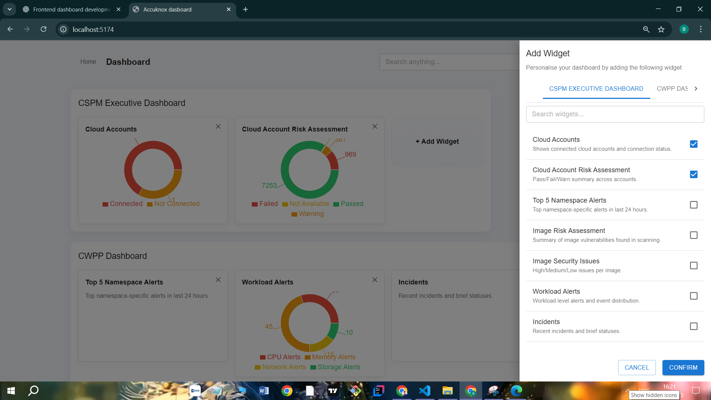

# AccuKnox Dashboard (Assignment)

## Live Demo
[https://accuknox-dashboard-amber.vercel.app/](https://accuknox-dashboard-amber.vercel.app/)

A customizable **Dashboard Application** built with **React, Vite, Material UI, and Redux Toolkit**.  
This project simulates a **cloud security executive dashboard** where categories and widgets can be dynamically added, removed, and visualized with charts (Pie Charts, Risk Assessments, Security Issues, etc.).

---

## Preview





## Tech Stack

- React + Vite — Fast frontend development  
- Material UI (MUI) — UI components and styling  
- Redux Toolkit — State management  
- Recharts — Pie charts and visualizations  

---

## Getting Started

### 1. Clone the repository
```bash
git clone https://github.com/JaYRaNa213/accuknox-dashboard.git
cd accuknox-dashboard
2. Install dependencies
bash
Copy code
npm install
3. Run locally (development mode)
bash
Copy code
npm run dev
The app will be available at:
http://localhost:5173

Build for Production
bash
Copy code
npm run build
npm run preview
This will generate an optimized build and start a preview server.

Features
Dynamic Categories and Widgets

Categories and widgets are loaded from src/data/initialData.json via Redux.

Each category (CSPM, CWPP, Registry Scan, etc.) contains one or more widgets.

Widget Types

Text Widgets → Display information text.

Pie Chart Widgets → Display risk assessments, issues, and status distribution.

Widget Management

Add new widgets (via dialog / sidebar)

Remove widgets (via close button)

Edit category members

Global Search

Search across all widgets and categories instantly.

Responsive UI

Grid layout adapts to all screen sizes.

Uses MUI’s responsive system.

Example Widgets
Cloud Accounts → Shows connected vs not connected accounts (Pie Chart)

Cloud Account Risk Assessment → Pass / Fail / Warning summary (Pie Chart)

Workload Alerts → CPU, Memory, Network, Storage alerts (Pie Chart)

Image Risk Assessment → Vulnerabilities by severity (Pie Chart)

Image Security Issues → Critical, High, Medium, Low issues (Pie Chart)

Project Structure
php
Copy code
accuknox-dashboard
├── .gitignore
├── eslint.config.js
├── index.html
├── package-lock.json
├── package.json
├── public
│   └── vite.svg
├── README.md
├── src
│   ├── App.jsx
│   ├── assets
│   │   └── react.svg
│   ├── components
│   │   ├── AddWidgetDialog.jsx
│   │   ├── AddWidgetRightSideBar.jsx
│   │   ├── CategoryPanel.jsx
│   │   ├── DashboardHeader.jsx
│   │   ├── SearchBar.jsx
│   │   ├── WidgetCard.jsx
│   │   └── WidgetLibraryDrawer.jsx
│   ├── data
│   │   └── initialData.json
│   ├── index.css
│   ├── main.jsx
│   ├── pages
│   │   └── DashboardPage.jsx
│   └── store
│       ├── dashboardSlice.js
│       └── store.js
├── tree.cjs
├── tree.txt
└── vite.config.js

Future Improvements
Authentication & role-based dashboard access

More chart types (bar, line, heatmap)

Backend integration (store widgets in DB instead of JSON)

Dark mode toggle

Author
Built with ❤️ by [Your Name]
Assignment for AccuKnox — Cloud Security Dashboard
